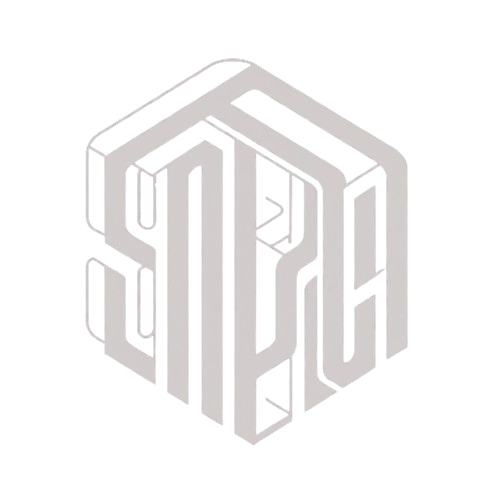

<p align="center">
  
</p>

---
# SMdRQA: Implementing Sliding Window MdRQA to get Summary Statistics Estimate of MdRQA measures from the Data
---

**Description:**  
SMdRQA is a powerful Python package designed for conducting Sliding Window Multidimensional Recurrent Quantification Analysis (SMdRQA). This specialized analysis technique allows researchers, data scientists, and analysts to explore temporal patterns and dependencies in multidimensional data sequences using a sliding window approach.

**Key Features:**  
- Perform Sliding Window Multidimensional Recurrent Quantification Analysis (SMdRQA) on time series data.
- Analyze temporal relationships and recurrent patterns across multiple dimensions using a sliding window mechanism.
- Customizable parameters for fine-tuning analysis settings such as window size, recurrence thresholds, and measures.
- Visualize and interpret recurrent patterns using interactive plots and visualizations.
- Gain insights into system dynamics, evolution, and behavior patterns over time with sliding window analysis.
- Conduct parameter exploration to find optimal values for time delay and embedding dimension.

**How SMdRQA Benefits You:**  
SMdRQA with sliding window functionality empowers users to:
- Uncover hidden temporal patterns and structures in complex data sequences.
- Identify recurrent events, transitions, and dependencies across multiple dimensions using a dynamic sliding window approach.
- Gain insights into evolving system dynamics and behavior patterns with continuous monitoring and analysis.
- Make informed decisions based on comprehensive temporal analysis results.

**Who Might be Using the Package:**  
- Researchers and academics studying temporal dynamics and patterns in multidimensional data using a sliding window approach.
- Data scientists and analysts working with time series data from diverse domains requiring dynamic pattern detection.
- Professionals seeking advanced tools for temporal analysis, pattern recognition, and dynamic modeling with sliding window analysis.
- Anyone interested in exploring complex temporal relationships and dependencies over time using a dynamic sliding window approach.

**Get Started with SMdRQA:**  
Start leveraging the capabilities of Sliding Window Multidimensional Recurrent Quantification Analysis with SMdRQA. Dive into your time series data, uncover recurrent patterns dynamically, and gain valuable insights into temporal dynamics. Install SMdRQA now and embark on a journey of advanced temporal analysis and discovery with sliding window functionality.
## Documentation

For detailed documentation and usage instructions, visit the [SMdRQA Documentation](https://swaragthaikkandi.github.io/SMdRQA/repo_details.html).

## Obtain SMdRQA

You can obtain SMdRQA by following these steps:
1. Clone the repository from GitHub using Git and install(cuttig edge version)
   - Cloning
     ```bash
     git clone https://github.com/SwaragThaikkandi/SMdRQA.git
     ```

   - Installing
     ```bash
     pip install -e path/to/cloned/repository
     ```
2. Install directly from GitHub
   ```bash
   pip install git+https://github.com/SwaragThaikkandi/SMdRQA.git
   ```
3. Install using PyPI
   ```bash
   pip install SMdRQA
   ```
4. Install using Docker
   ```bash
   docker pull tsk365/smdrqa
   ```
## Provide Feedback

Your feedback is valuable for improving SMdRQA. You can provide feedback in the following ways:

- Report bugs or issues: Submit bug reports and issues on the [GitHub Issue Tracker](https://github.com/SwaragThaikkandi/SMdRQA/issues).
- Suggest enhancements or new features: Share your ideas and suggestions for enhancements on the Issue Tracker.

## Private Vulnerability Reporting Guidelines

If you have identified a security vulnerability in our project, we encourage you to report it responsibly following the instructions outlined below.

### Reporting Process

1. **Contact Information**: For private vulnerability reports, please contact our team via email at [swaragtgithub@gmail.com](mailto:swaragtgithub@gmail.com). You can also reach out to repository owner via GitHub

2. **Encryption**: Use encryption when sending sensitive information. Encrypt any attachments or communications using strong encryption standards such as PGP (Pretty Good Privacy) or GPG (GNU Privacy Guard).

3. **Reporting Format**: When reporting vulnerabilities, provide clear and detailed information about the issue, including steps to reproduce, potential impact, and any relevant technical details. Use the following template:

   ```markdown
   ### Vulnerability Report Template

   - **Title**: [Title of Vulnerability]
   - **Description**: [Description of the vulnerability, including steps to reproduce]
   - **Impact**: [Potential impact of the vulnerability]
   - **Affected Versions**: [Versions of the project affected by the vulnerability]
   - **Proposed Solution**: [Optional: Proposed solution or mitigation]
   - **Additional Information**: [Any additional information or context]


## Contribute to SMdRQA

### Requirements for Acceptable Contributions

- Ensure that your contributions align with the project's goals and objectives.
- Follow the coding standards and guidelines outlined in our [Coding Standards](https://github.com/SwaragThaikkandi/SMdRQA/blob/main/CODING_STANDARDS.md) document.
- Provide clear and detailed descriptions of your contributions, including any changes or enhancements made.
- Test your code thoroughly to ensure it functions as intended and does not introduce any regressions.
- Adhere to the project's licensing terms and copyright policies.

### You can contribute to the development of SMdRQA by:

1. Fork the repository on GitHub.
2. Create a new branch for your contributions (`git checkout -b feature/your-feature-name`).
3. Make your changes and commit them with clear and descriptive commit messages.
4. Push your changes to your forked repository (`git push origin feature/your-feature-name`).
5. Submit a pull request (PR) to the main repository for review and integration.

## Test Function Addition Policy

Welcome to the test function addition policy for the SMdRQA project. This policy outlines guidelines and best practices for adding test functions to the repository.

### Purpose

Testing is a critical aspect of software development that ensures code quality, reliability, and functionality. The purpose of this policy is to define the standards and procedures for adding test functions to the SMdRQA project repository.

## Guidelines

1. **Test Coverage**: All new features, bug fixes, and code changes must include corresponding test functions to validate their behavior. Aim for comprehensive test coverage to minimize regressions and improve code reliability.

2. **Testing Levels**: Follow the testing pyramid principles by including unit tests, integration tests, and possibly end-to-end tests as appropriate. Each level of testing serves a specific purpose and contributes to overall testing effectiveness.

3. **Naming Conventions**: Use descriptive and meaningful names for test functions that accurately reflect the behavior being tested. Follow a consistent naming convention (e.g., `test_function_name`) to enhance readability and maintainability.

4. **Test Isolation**: Ensure that test functions are isolated, independent, and do not rely on external dependencies or state. Use mocking or stubbing techniques when necessary to simulate external interactions.

5. **Test Structure**: Organize test functions into logical groups or test suites based on the functionality being tested. Use testing frameworks such as pytest or unittest to structure and execute tests effectively.

6. **Assertions**: Include appropriate assertions within test functions to verify expected outcomes and behavior. Use assertion methods provided by the testing framework (e.g., `assertEqual`, `assertTrue`, `assertRaises`) to validate results.

7. **Documentation**: Provide clear and concise documentation for test functions, including descriptions of test scenarios, inputs, expected outputs, and any preconditions or setup steps required.

## Contribution Guidelines

1. **Pull Requests**: When submitting pull requests that include code changes, ensure that corresponding test functions are added or updated accordingly. Test failures should be resolved before merging changes into the main branch.

2. **Code Review**: Test functions are subject to code review by maintainers and contributors. Follow coding standards, best practices, and the established test function guidelines during code reviews.

3. **Continuous Integration**: Test functions are automatically executed as part of the continuous integration (CI) process. Ensure that tests pass successfully before merging changes.

## Conclusion

By adhering to this test function addition policy, contributors help maintain code quality, improve test coverage, and enhance the overall reliability and stability of the SMdRQA project. Thank you for your commitment to quality assurance and testing excellence.

---

**Note:** This document is subject to updates and changes. Please refer to the latest version in our repository for the most up-to-date information.


We welcome contributions from the community to improve and enhance SMdRQA!

For more detailed information on how to use SMdRQA, refer to the [SMdRQA Documentation](https://swaragthaikkandi.github.io/SMdRQA/repo_details.html).


[](https://doi.org/10.5281/zenodo.10854678)
[](https://img.shields.io/github/license/SwaragThaikkandi/SMdRQA/LICENSE)
[](CODE_OF_CONDUCT.md)
[](https://www.bestpractices.dev/projects/8719)

## Package integrity

[](https://github.com/SwaragThaikkandi/SMdRQA/actions/workflows/python-package.yml)
[](https://github.com/SwaragThaikkandi/SMdRQA/actions/workflows/pages/pages-build-deployment)


## PyPI Package Information

[](https://github.com/SwaragThaikkandi/SMdRQA/actions/workflows/python-publish.yml)
[](https://pypi.org/project/SMdRQA/)
[](https://pypi.python.org/pypi/SMdRQA)
[](https://pypi.org/project/SMdRQA/)
[](https://pypi.org/project/SMdRQA/)
[](https://pypi.org/project/SMdRQA/)
[](https://pypi.org/project/SMdRQA/)
[](https://pepy.tech/project/SMdRQA)

## Security

[](https://securityscorecards.dev/viewer/?uri=github.com/SwaragThaikkandi/SMdRQA)
[](https://snyk.io//advisor/python/SMdRQA)
[](https://github.com/SwaragThaikkandi/SMdRQA/actions/workflows/scorecard.yml)
[](https://github.com/SwaragThaikkandi/SMdRQA/actions/workflows/github-code-scanning/codeql)
[](https://github.com/SwaragThaikkandi/SMdRQA/actions/workflows/bandit.yml)
[](https://github.com/SwaragThaikkandi/SMdRQA/actions/workflows/dependency-review.yml)
[](https://github.com/SwaragThaikkandi/SMdRQA/actions/workflows/devskim.yml)
[](https://github.com/SwaragThaikkandi/SMdRQA/actions/workflows/ossar.yml)


## GitHub

[](https://github.com/SwaragThaikkandi/SMdRQA/releases)
[](https://github.com/SwaragThaikkandi/SMdRQA/pulls)
[](https://github.com/SwaragThaikkandi/SMdRQA/stargazers)
[](https://github.com/SwaragThaikkandi/SMdRQA/languages)
[](https://github.com/SwaragThaikkandi/SMdRQA/search)
[](https://github.com/SwaragThaikkandi/SMdRQA)
[](https://github.com/SwaragThaikkandi/SMdRQA)
[](https://github.com/SwaragThaikkandi/SMdRQA)
[](https://github.com/SwaragThaikkandi/SMdRQA)
[](https://gitlab.com/SwaragThaikkandi/SMdRQA/pipelines)
[](https://github.com/SwaragThaikkandi/SMdRQA/actions/workflows/code-coverage.yml)
[](https://codecov.io/gh/SwaragThaikkandi/SMdRQA)
[](https://github.com/SwaragThaikkandi/SMdRQA/releases)
[](https://github.com/SwaragThaikkandi/SMdRQA/discussions)
[](https://github.com/SwaragThaikkandi/SMdRQA)
[](https://github.com/SwaragThaikkandi/SMdRQA/actions/workflows/label.yml)
[](https://github.com/SwaragThaikkandi/SMdRQA/actions/workflows/docs-build.yml)


