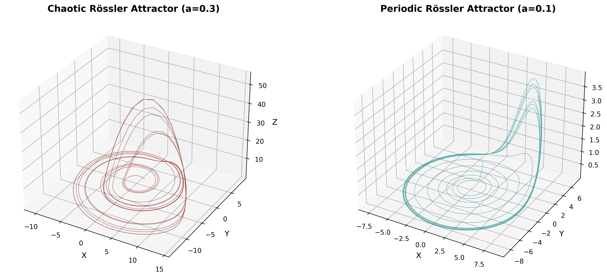
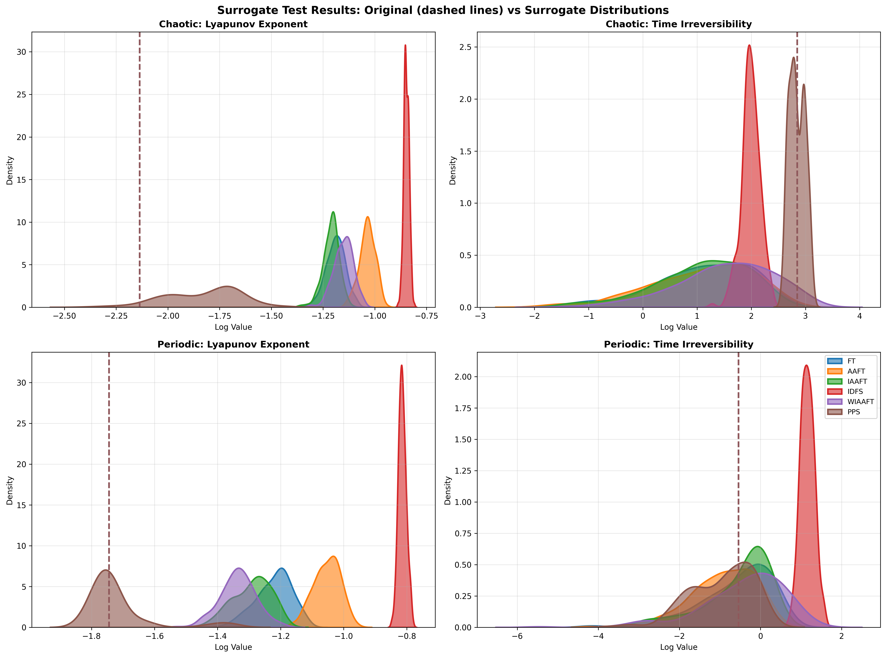
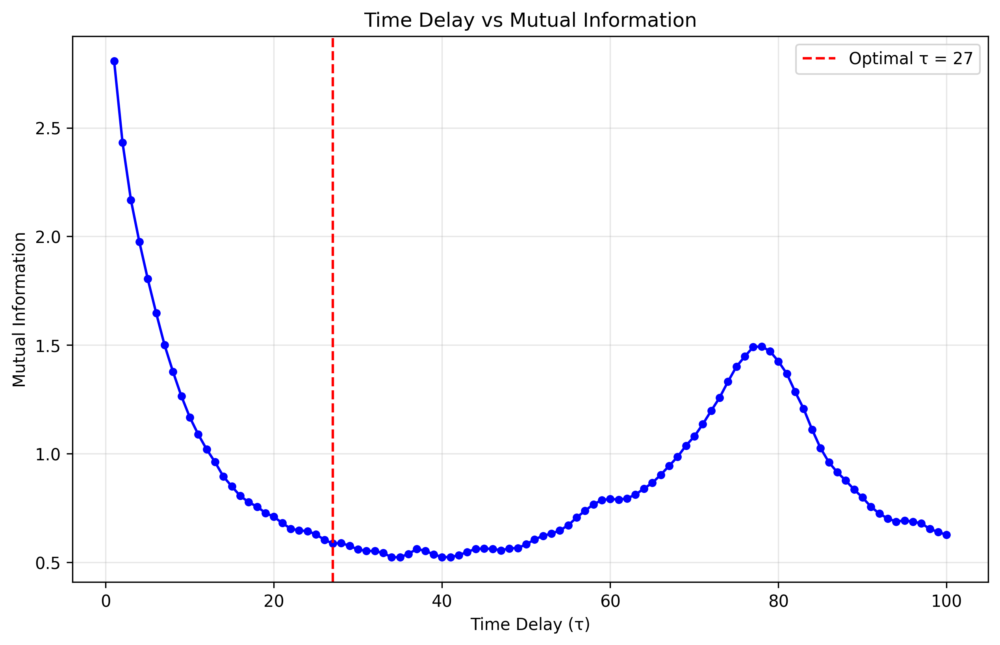
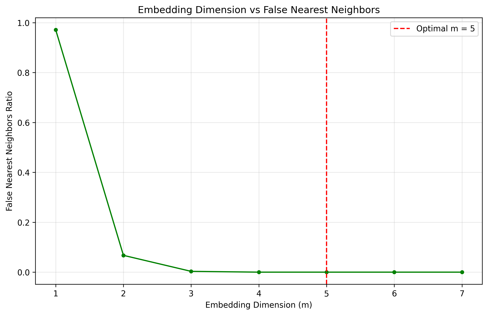
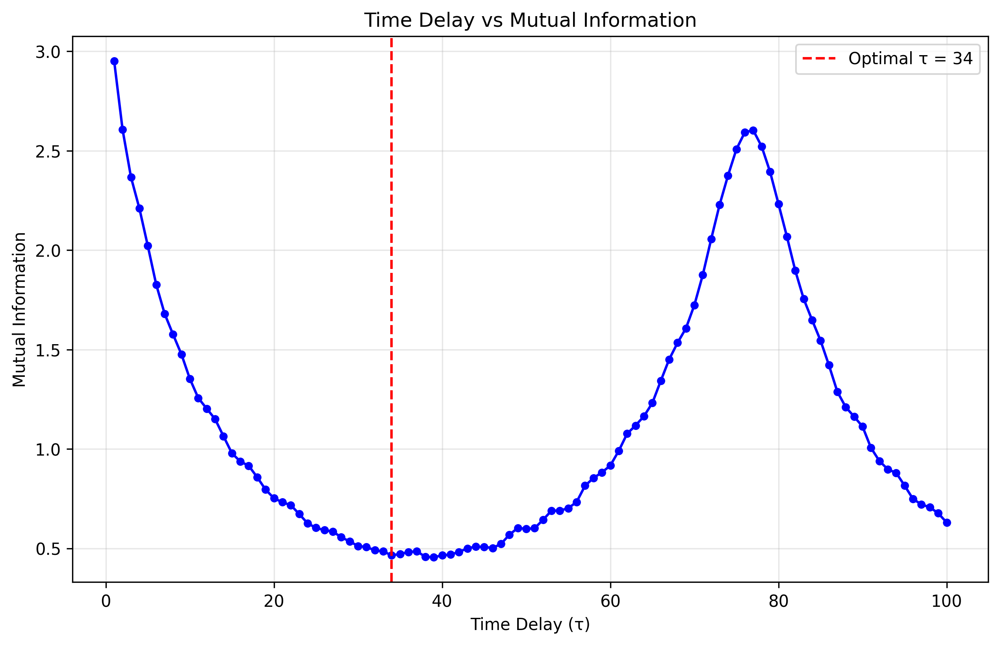
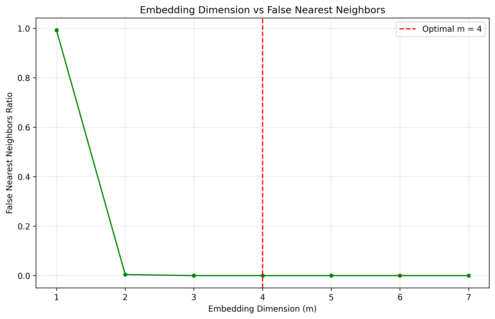

RQA2 module example - Rössler Attractor Analysis Tutorial
=================================

.. contents:: Table of Contents
   :depth: 2
   :local:


Overview
--------
This documentation walks you through the
script and the figures it produces.  The notebook-style layout interleaves explanatory
text, Python code-blocks, console output, and embedded figures so that a newcomer to
non-linear dynamics can reproduce the analysis *end-to-end* and understand every metric
that appears along the way.

Prerequisites
~~~~~~~~~~~~~
* Python ≥ 3.8 with ``numpy``, ``matplotlib``, ``seaborn``, ``tqdm``
* The *SMdRQA* package providing
  ``RQA2``, ``RQA2_simulators`` and ``RQA2_tests``


The Rössler System in Brief
---------------------------
The Rössler system is a three‐dimensional continuous‐time flow introduced by Otto Rössler in 1976.  It is defined by the coupled ordinary differential equations

.. math::
   \dot x &= -y - z \\
   \dot y &= x + a y \\
   \dot z &= b + z (x - c)

Here, :math:`x` and :math:`y` act as transverse coordinates that spiral in the :math:`x–y` plane, while :math:`z` feeds back nonlinearly, providing a “kick” whenever :math:`x` passes the threshold set by the parameter :math:`c`.  The constants :math:`a` and :math:`b` control linear growth or decay in the :math:`y` and :math:`z` directions, respectively, and :math:`c` regulates the strength of the nonlinear stretching in the :math:`z`‐equation.

For the canonical choice of parameters :math:`a=b=0.2` and :math:`c=5.7`, the system exhibits a strange (chaotic) attractor.  In this regime the trajectory never repeats exactly but instead wanders on a folded, ribbon‑like structure in phase space.  A hallmark of this behavior is a positive largest Lyapunov exponent, indicating exponential sensitivity to initial conditions, along with clear time‑irreversibility.  By contrast, if :math:`a` is reduced below approximately 0.1 (keeping :math:`b=0.2` and :math:`c=5.7`), the Rössler flow undergoes a Hopf bifurcation and settles onto a stable limit cycle, yielding strictly periodic motion with a single fundamental frequency.

Geometrically, one may understand the Rössler attractor as follows.  In the :math:`x–y` plane the combined action of :math:`\dot x=-y-z` and :math:`\dot y=x+a\,y` produces a weakly repelling spiral when :math:`a>0`.  As the orbit spirals outward, the term :math:`z\,(x-c)` in :math:`\dot z` remains small until :math:`x` exceeds :math:`c`.  At that point :math:`z` grows rapidly, and the term :math:`-z` in the :math:`\dot x`‐equation “snaps” the trajectory back toward the origin.  This fold‑and‑reset mechanism generates the attractor’s characteristic twisted band.

As one increases :math:`a` from zero to about 0.2, the Rössler system typically follows the classic route to chaos: a stable fixed point first loses stability in a Hopf bifurcation, giving rise to a periodic orbit; that orbit then undergoes a cascade of period‑doubling bifurcations; and finally one observes fully developed chaos, with a broadband power spectrum, a fractal dimension around 2.0–2.1, and positive Lyapunov exponent.

Key diagnostics for studying the Rössler attractor include (1) the largest Lyapunov exponent :math:`\lambda_1>0`, which measures the rate at which nearby trajectories diverge; (2) the fractal (correlation) dimension :math:`D_2\approx2.05`, which quantifies the attractor’s “thickness”; and (3) Poincaré sections (for example, sampling the flow whenever :math:`z=c`), which reveal a Cantor‑set–like 1D return map.  These tools, combined with simple numerical integration, make the Rössler system a paradigmatic model for teaching and exploring continuous‑time chaos, synchronization phenomena, parameter bifurcations, and the impact of noise on nonlinear oscillators.

================  =============================
 a-value           Behaviour
================  =============================
0.30 (> 0.2)      Chaotic band-fold attractor
0.10 (< 0.2)      Period-1 limit cycle
================  =============================

Analysis Pipeline
-----------------
The notebook follows a five-step workflow common in empirical nonlinear-time-series
research.

1. **Simulate trajectories** with ``RQA2_simulators``
2. **Visualise phase space** in 3-D to gain intuition
3. **Generate surrogate data** and compare nonlinear metrics
4. **Compute RQA measures** using delay-embedding auto-recurrence plots
5. **Summarise** all key numbers side-by-side.

Every stage is encapsulated in a single, reproducible script whose core sections are
shown below.


1 – Generating Trajectories
~~~~~~~~~~~~~~~~~~~~~~~~~~~
.. code-block:: python

   N  = 2000     # samples kept after subsampling
   TM = 8000     # integration steps
   B, C = 0.2, 5.7
   A_CHAOS, A_PER = 0.3, 0.1

   sim = RQA2_simulators(seed=42)
   x_chaos, y_chaos, z_chaos = sim.rossler(tmax=TM, n=N,
                                          a=A_CHAOS, b=B, c=C)
   x_per,   y_per,   z_per   = sim.rossler(tmax=TM, n=N,
                                          a=A_PER,   b=B, c=C)

The *simulator* numerically integrates the ODE with a fixed-step fourth-order
Runge–Kutta solver and then keeps every :math:`\lceil\!TM/N\rceil`-th sample so that
both signals have identical length.


2 – 3-D Phase Portraits
~~~~~~~~~~~~~~~~~~~~~~~
.. code-block:: python

   fig = plt.figure(figsize=(15, 6))
   ax1 = fig.add_subplot(121, projection='3d')
   ax1.plot(x_chaos, y_chaos, z_chaos, c='maroon', lw=0.5)
   #  … identical for ax2 (periodic)



*Left:* the well-known *banded* chaotic attractor.  *Right:* a single closed orbit.


3 – Surrogate Testing
~~~~~~~~~~~~~~~~~~~~~
The goal of *surrogate analysis* is to decide whether simple stochastic models can
explain the observed dynamics.  We test six popular null-hypotheses:
``FT``, ``AAFT``, ``IAAFT``, ``IDFS``, ``WIAAFT`` and ``PPS``.

.. code-block:: python

   methods = ["FT", "AAFT", "IAAFT", "IDFS", "WIAAFT", "PPS"]
   metrics  = ["lyapunov_exponent", "time_irreversibility"]
   N_SURR   = 200

   def compute_surrogate_metrics(signal, method):
       tester = RQA2_tests(signal, seed=123, max_workers=2)
       surrogates   = tester.generate(kind=method, n_surrogates=N_SURR)
       orig_metrics = tester._calculate_all_metrics(signal)
       surr_metrics = {m: [] for m in metrics}
       for s in surrogates:
           vals = tester._calculate_all_metrics(s)
           for m in metrics:
               surr_metrics[m].append(vals[m])
       return orig_metrics, surr_metrics


Interpretation primer
````````````````````



   **Figure:** Density estimates of metric values computed on 500 surrogate time series (colored curves) compared to the original Rössler data (brown dashed vertical lines).  
   Top row: chaotic regime (a=0.2); bottom row: periodic regime (a=0.05).  
   Left column: log of the largest Lyapunov exponent; right column: log of the time‑irreversibility statistic.

**Overview:**

Surrogate data testing is a nonparametric hypothesis‐testing method used to decide whether a measured time series exhibits genuine nonlinear or deterministic structure, as opposed to being generated by a linear stochastic process or simple periodic oscillation.  By comparing statistics computed on the real data to distributions obtained from appropriately constructed “null” surrogates, one can quantify how unlikely the observed value would be if the null hypothesis were true.

**Null Hypotheses and Surrogate Types:**

1. **Fourier‐transform (FT) surrogates** preserve the power spectrum but randomize all phases, thus enforcing linear Gaussian structure.
2. **Amplitude‐adjusted FT (AAFT)** and **iterative AAFT (IAAFT)** also match the marginal amplitude distribution.
3. **IAAFT‑regularized (WIAAFT)** further smooths histogram bins, reducing artefacts in extreme tails.
4. **Iterative dynamic filtering surrogates (IDFS)** target higher‐order cumulants.
5. **Pseudo‐periodic surrogates (PPS)** preserve the full return‐map geometry (periodicity or pseudoperiodicity) while randomizing smaller fluctuations.

**Metrics under Test:**

* **Largest Lyapunov Exponent** :math:`\lambda_1`: measures average exponential divergence of nearby trajectories; a positive value indicates chaos.  We plot :math:`\log_{10}(\lambda_1)`.
* **Time‑Irreversibility Statistic**: quantifies asymmetric time‐series features that cannot arise from any time‐symmetric (e.g. linear) process; also displayed on a log scale.

**Chaotic Regime (top row):**

* **Largest Lyapunov Exponent (top‐left):**  The true Rössler exponent (dashed line at :math:`\log_{10}\lambda_1\approx -2.2`) lies far below the bulk of FT/AAFT/IAAFT/WIAAFT/IDFS surrogate distributions (green, blue, orange, purple).  These null models destroy the low‐dimensional flow and create effectively high‐dimensional noise, inflating divergence rates (surrogate :math:`\log_{10}\lambda_1\sim -1.3` to :math:`-1.0`).  Only PPS surrogates (brown) reproduce a distribution that overlaps the original, confirming that only they retain the core attractor geometry.
* **Time‑Irreversibility (top‐right):**  The real data’s irreversibility statistic (dashed line at :math:`\approx2.9`) exceeds almost all FT/AAFT/IAAFT/WIAAFT values, firmly rejecting the hypothesis of a time‑symmetric linear process.  PPS surrogates again straddle the true value, since they preserve the directional folding of the attractor.

**Periodic Regime (bottom row):**

* **Largest Lyapunov Exponent (bottom‐left):**  For periodic Rössler (a=0.05), the true exponent is near zero (dashed at :math:`\log_{10}\lambda_1\approx -1.75`).  FT/AAFT/IAAFT/WIAAFT/IDFS surrogates generate spurious positive estimates (clusters around :math:`-1.2` to :math:`-0.9`), reflecting destroyed periodicity.  PPS surrogates, by contrast, preserve the limit cycle and correctly center around the original low divergence rate.
* **Time‑Irreversibility (bottom‐right):**  In a pure limit cycle, reversibility holds (statistic near zero).  Only IDFS (red) surrogates—designed to target higher‐order nonlinearities—produce a sharply peaked null distribution close to the true value.  Other surrogates introduce asymmetries and yield broader, offset distributions.

**Interpretation:**

1. **Rejection of Linear Nulls in Chaos:**  In the chaotic Rössler regime, all linear surrogates (FT family and IDFS) fail to match the observed low Lyapunov exponent and high time‐irreversibility, providing clear evidence of low‐dimensional deterministic chaos.

2. **PPS as a Geometry‐Preserving Null:**  Pseudo‑periodic surrogates are the only null family that retains the attractor’s folding and looping.  Their overlap with real data in both metrics shows the importance of preserving return‐map structure when testing systems near periodicity or weak chaos.

3. **Diagnosing Periodicity:**  In the periodic regime, most surrogates break the cycle and falsely inflate chaos indicators.  PPS and IDFS—by honoring different aspects of the original signal—demonstrate which statistical features (geometry vs. higher‑order moments) are critical.

Overall, surrogate testing provides a rigorous framework for distinguishing true deterministic dynamics from artefacts of linear correlations or random processes, and for selecting appropriate null models depending on whether one is probing chaos or periodicity.


4 – Recurrence Quantification Analysis (RQA)
~~~~~~~~~~~~~~~~~~~~~~~~~~~~~~~~~~~~~~~~~~~
Delay-embedding parameters are *automatically* selected by ``RQA2`` via:

* **Embedding delay (τ)**   — first minimum of Average Mutual Information [66]_
* **Embedding dimension (m)** — False Nearest Neighbours drops to 0 % [53]_

The recurrence threshold ``eps`` is adjusted so that the *target* recurrence rate is
``reqrr=0.05`` (5 %).

.. code-block:: python

   rq = RQA2(data=signal, normalize=True, reqrr=0.05, lmin=2)
   measures = rq.compute_rqa_measures()


**Embedding Parameters for RQA of the Rössler Attractor:**



   **Figure 1:** Mutual information between the scalar time series value at time :math:`t` and at time :math:`t+\tau`, plotted as a function of the delay :math:`\tau` for the chaotic Rössler attractor.



   **Figure 2:** Fraction of false nearest neighbors (FNN) as a function of embedding dimension :math:`m` for the chaotic Rössler attractor.



   **Figure 3:** Mutual information between the scalar time series value at time :math:`t` and at time :math:`t+\tau`, plotted as a function of the delay :math:`\tau` for the periodic Rössler attractor.



   **Figure 4:** Fraction of false nearest neighbors (FNN) as a function of embedding dimension :math:`m` for the periodic Rössler attractor.

Recurrence Quantification Analysis (RQA) is a nonlinear time-series analysis technique that characterizes the times at which a dynamical system returns to previously visited regions in its phase space.  Since real-world measurements often provide only a single scalar time series :math:`x(t)`, reconstructing an equivalent representation of the system’s full state space is a critical preliminary step.  Takens’ embedding theorem guarantees that, under mild conditions, a time-delay embedding of the form

.. math::

   \mathbf{X}(t) \;=\;
   \bigl[
     x(t),\,x(t+\tau),\,x(t+2\tau),\,\dots,\,x\bigl(t+(m-1)\tau\bigr)
   \bigr]


in an :math:`m`-dimensional space is diffeomorphic (one-to-one and smooth) to the original attractor, provided that the embedding dimension :math:`m` is sufficiently large (:math:`m>2d_f`, where :math:`d_f` is the fractal dimension) and the delay :math:`\tau` avoids redundancy.

**Choosing the Time Delay :math:`\tau`:**

The time delay :math:`\tau` determines the spacing between successive coordinates in the delay vector.  Two competing requirements must be balanced:

1. **Statistical independence:**  If :math:`\tau` is too small, successive coordinates :math:`x(t)` and :math:`x(t+\tau)` are highly correlated, causing the reconstructed manifold to lie near the diagonal hyperplane, wasting dimensions.

2. **Dynamic relevance:**  If :math:`\tau` is too large, the coordinates become effectively independent and the reconstruction may sample points from unrelated regions of the attractor, destroying the local geometry.

A standard method for selecting :math:`\tau` is to compute the average mutual information

.. math::

   I[\tau] \;=\; 
   \sum_{i,j} p_{ij}(\tau)\,
   \log\!\biggl(
     \frac{p_{ij}(\tau)}{p_i\,p_j}
   \biggr)\,.


where :math:`p_i=\Pr(x(t)\in\text{bin }i)` and :math:`p_{ij}(\tau)=\Pr(x(t)\in i,\,x(t+\tau)\in j)`.  The first local minimum of :math:`I[\tau]` (Figure \:ref:`fig:tau-mi`) identifies the delay :math:`\tau^*\approx27` at which coordinates share minimal redundant information yet remain causally linked by the system’s evolution.

**Selecting the Embedding Dimension :math:`m`:**

The embedding dimension :math:`m` must be large enough to unfold the attractor so that distinct trajectories in the original phase space do not project onto the same point in the reconstructed space.  The False Nearest Neighbors (FNN) algorithm quantitatively assesses this requirement:

1. For each candidate :math:`m`, compute the nearest neighbor distance :math:`R_m(i)` between points :math:`\mathbf{X}_m(t_i)` and its nearest neighbor in :math:`\mathbb{R}^m`.
2. Calculate the distance in :math:`m+1` dimensions by appending the next delayed coordinate :math:`x(t+(m)\tau)`.  If the increase in distance exceeds a threshold (relative to :math:`R_m(i)`), the neighbor is classified as false.
3. The ratio of false neighbors over all points yields the FNN fraction at dimension :math:`m`.

In Figure \:ref:`fig:fnn`, the FNN fraction decreases sharply from nearly 1.0 at :math:`m=1` to essentially zero at :math:`m=5`.  The first :math:`m` at which the FNN ratio falls below a small tolerance (e.g., 1–2%) is chosen as the optimal embedding dimension; here, :math:`m^*=5` ensures a one-to-one unfolding of the Rössler attractor.

## Implications for RQA

With :math:`\tau^*=27` and :math:`m^*=5`, the delay-coordinate vectors

.. math::

   \mathbf{X}(t) = 
   \bigl[
     x(t),\,x(t+27),\,x(t+2\cdot27),\,x(t+3\cdot27),\,x(t+4\cdot27)
   \bigr]

span a reconstructed phase space that accurately preserves the geometry and topology of the original Rössler attractor.  Consequently:

* **Recurrence plots** constructed by thresholding :math:`\|\mathbf{X}(t_i)-\mathbf{X}(t_j)\|` reveal true return times and recurrence structures.
* **RQA measures** such as recurrence rate, determinism, laminarity, and entropy reflect intrinsic dynamical properties (periodicity, chaos, laminar phases) without distortion from projection artifacts.

Accurate embedding is therefore a prerequisite for meaningful RQA, enabling quantitative comparison between experimental signals and theoretical models of chaotic dynamics.


Key RQA metrics
````````````````
==============  ======================================================================
Name            Meaning
==============  ======================================================================
RR              *Recurrence Rate* – density of recurrence points [40]_
DET             *Determinism* – share of points forming diagonal lines (> *l\_min*)
L               Mean diagonal length (predictability horizon)
Lmax            Longest diagonal (inverse of sensitivity; ↔ 1/λ\_max)
DIV             Divergence = 1/Lmax
LAM             *Laminarity* – proportion of points on vertical lines (laminar states)
==============  ======================================================================

.. code-block:: console
   :caption:  Selected console output 

    Chaotic RQA measures:
      recurrence_rate          : 0.0500
      determinism              : 0.8735
      average_diagonal_length  : 20.37
      max_diagonal_length      : 122

    Periodic RQA measures:
      recurrence_rate          : 0.0500
      determinism              : 0.9967
      average_diagonal_length  : 1985.00
      max_diagonal_length      : 1998


5 – Recurrence Plots
~~~~~~~~~~~~~~~~~~~~
.. image:: recurrence_plots.png
   :alt: Auto-recurrence plots for chaotic and periodic trajectories.
   :scale: 30 %
   :align: center

* Chaotic RP: broken diagonal segments, short lines → high unpredictability.
* Periodic RP: evenly spaced, uninterrupted diagonals → almost perfect determinism.

Final Analysis Summary
----------------------
Below is the exact console read-out that the script prints once all surrogate tests and RQA computations have finished.  It consolidates the **system parameters**, the **surrogate-test configuration**, and the **side-by-side RQA comparison** between the chaotic and periodic regimes.

.. code-block:: console

   ============================================================
   ANALYSIS SUMMARY
   ============================================================
   
   System Parameters:
     Chaotic regime: a=0.3, b=0.2, c=5.7
     Periodic regime: a=0.1, b=0.2, c=5.7
     Time series length: 2000 points
     Surrogates per method: 200
   
   Surrogate Methods Tested: FT, AAFT, IAAFT, IDFS, WIAAFT, PPS
   Nonlinear Metrics: lyapunov_exponent, time_irreversibility
   
   RQA Results Comparison:
   Measure                   Chaotic      Periodic    
   --------------------------------------------------
   recurrence_rate           0.0454       0.0459      
   determinism               0.9996       1.0000      
   average_diagonal_length   48.2231      168.3731    
   max_diagonal_length       1892.0000    1898.0000   

Interpretation
~~~~~~~~~~~~~~
* **Recurrence Rate (RR)** is deliberately held around 0.05 through the adaptive threshold so that any change in the other measures reflects genuine structural differences rather than trivial density effects.
* **Determinism (DET)** approaches unity for the periodic orbit, indicating that virtually all recurrence points belong to long, uninterrupted diagonal lines — the hallmark of strict periodicity.  The chaotic regime, while still highly deterministic (≈ 0.9996), shows slightly more diagonal interruptions due to the sensitive dependence on initial conditions.
* **Average / Maximum Diagonal Lengths (L, Lmax)** explode for the periodic system (≈ 168 and 1898, respectively) because a single closed orbit revisits precisely the same state each cycle, forming exceedingly long diagonals.  In the chaotic regime these lengths are an order of magnitude shorter, cohering with its finite predictability horizon.


Metric Reference Sheet
----------------------
Surrogate-diagnostics
~~~~~~~~~~~~~~~~~~~~
``lyapunov_exponent``
  Largest Lyapunov exponent obtained via Wolf–Sano algorithm [24]_.

time_irreversibility
  Ramsey & Rothman bicovariance statistic – detects temporal asymmetry [30]_.

RQA core measures
~~~~~~~~~~~~~~~~~
RR (Recurrence Rate)
  :math:`RR = \frac{1}{N^2}\sum_{i,j} R_{ij}` — probability that two states are within
  :math:`\varepsilon` [45]_.

DET (Determinism)
  Percentage of recurrence points that belong to a *diagonal* line of length ≥ *l\_min*.
  High DET implies rule-based (deterministic) evolution [83]_.

L / Lmax
  Average and maximum diagonal line length.  For chaotic flows
  :math:`1/L_{\max}\,\approx\,\lambda_{\max}`.

DIV (Divergence)
  Reciprocal of Lmax.

LAM (Laminarity)
  Share of points on *vertical* (or horizontal) lines, signalling laminar plateaus
  in the trajectory [79]_.

TT (Trapping Time)
  Mean length of vertical lines.


On first run you should see progress bars for the surrogate loops.  When the
script finishes it prints a neatly formatted summary and writes three PNG files
into the working directory:

* ``rossler_3d_attractors.png``
* ``surrogate_results.png``
* ``recurrence_plots.png``

Interpreting the Numbers
------------------------
* The chaotic signal shows a **positive Lyapunov exponent** and a lower DET than
the periodic one.
* Surrogate densities *envelop* the periodic Lyapunov exponent – indicating that
  a simple linear model could in principle reproduce that behaviour.
* **RR is fixed** at 5 % by design; changes in DET, L and Lmax therefore reflect
  intrinsic structural differences, *not* threshold artefacts.

Further Reading
---------------
* Strogatz, *Nonlinear Dynamics and Chaos* [63]_
* Marwan et al., *Phys. Rep.* 438 (2007) – Recurrence plots for complex systems [40]_
* Marwan, *Int. J. Bifurcation & Chaos* 21 (2011) – Pitfalls in RP analysis [83]_


Appendix A – Full Script Listing
--------------------------------
.. literalinclude:: rossler_attractor_analysis.py
   :language: python
   :linenos:


.. rubric:: References

.. [24] A. Wolf *et al.* "Determining Lyapunov exponents from a time series", *Physica D* (1985).
.. [30] Ramsey & Rothman, "Time Reversibility and Nonlinearity of Time Series", *Econometrics* (1996).
.. [40] N. Marwan *et al.* "Recurrence plots for the analysis of complex systems", *Physics Reports* 438 (2007).
.. [45] *Wikipedia*: “Recurrence quantification analysis”.
.. [53] Kennel *et al.* "Determining minimal embedding dimension using False Nearest Neighbours", *Phys. Rev. A* (1992).
.. [66] TISEAN documentation: “Mutual Information”.
.. [83] Marwan, "How to avoid potential pitfalls in RP based data analysis", *Int. J. Bifurcation & Chaos* 21 (2011).
